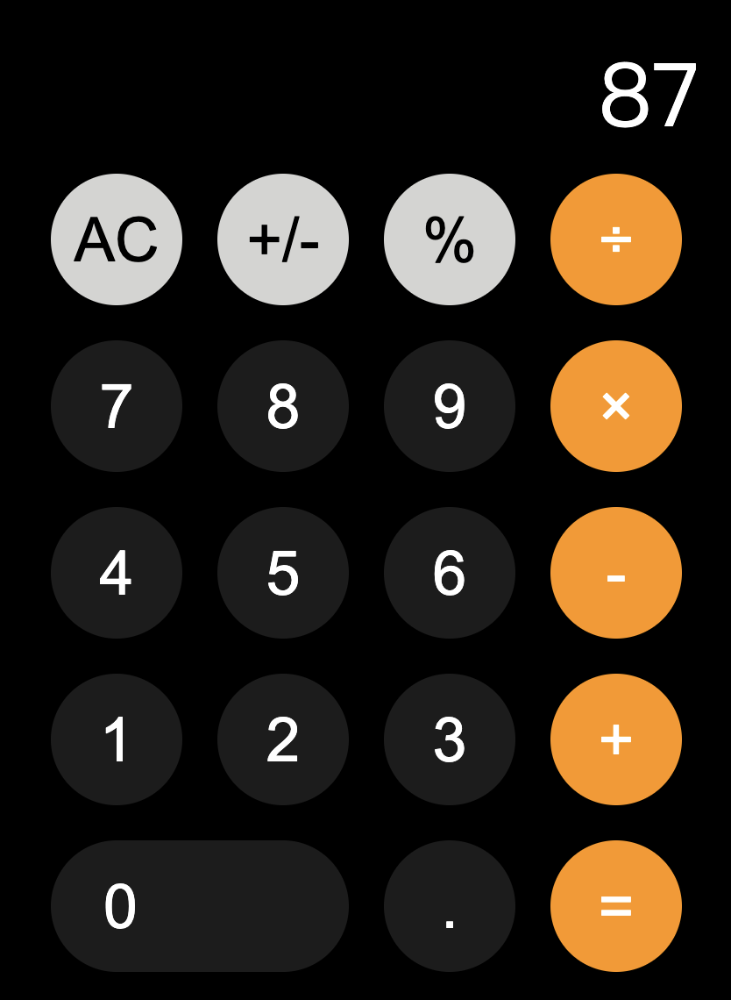

# HW2: React Redux Calculator

 [](https://app.netlify.com/sites/galtz-web-calculator/deploys)



## 如何使用

Clone 下專案

```shell
git clone https://github.com/YogaPan/rookie-homework rookie-homework
cd rookie-homework/HW2
```

開發環境 hot reload

```shell
npm install && npm start
```

### Production

Build 專案

```shell
npm run build
```

Serve 靜態網頁

```shell
npx serve -s build -l 5000
```

透過 http://localhost:5000 看到 Production 成品

### 透過 Docker 使用

打包成 Image

```shell
docker build -t galtz/web-calculator .
```

把 Container 裡面的 5000 port 對應到 localhost 的 8080 port:

```shell
docker run -p 8080:5000 --name calculator -d galtz/web-calculator
```

透過 http://localhost:8080 看到 Production 成品

### Serve 套件

最簡單的方式在 localhost 建立靜態網頁
https://github.com/zeit/serve

### 計算機邏輯

Big.js
https://github.com/MikeMcl/big.js/

參考專案：
[GitHub - ahfarmer/calculator: Simple calculator built with React](https://github.com/ahfarmer/calculator)